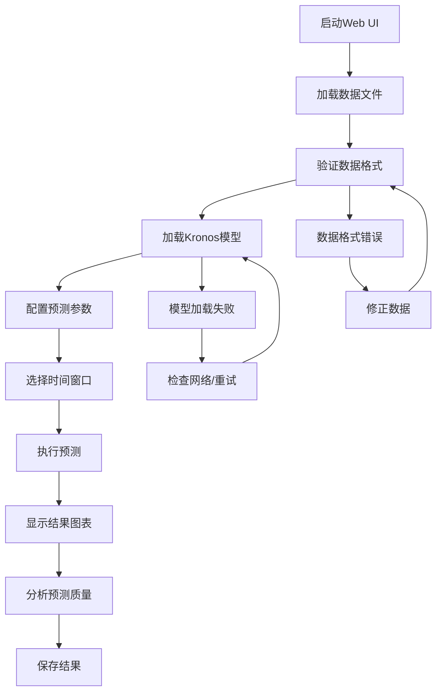

# Kronos Web UI 启动和使用指南

## 🌐 Web UI 概述

Kronos Web UI 提供了一个直观的图形化界面，让用户无需编写代码即可使用Kronos进行金融预测。界面支持数据上传、模型配置、参数调整和结果可视化等功能。

## 🚀 启动方式

### 方式1: Python脚本启动（推荐）
```bash
cd webui
python run.py
```

### 方式2: Shell脚本启动
```bash
cd webui
chmod +x start.sh
./start.sh
```

### 方式3: 直接启动Flask应用
```bash
cd webui
python app.py
```

启动成功后，访问: **http://localhost:7070**

## 📋 界面功能详解

### 1. 数据管理区域

#### 数据文件加载
- **支持格式**: CSV、Feather
- **数据位置**: 自动扫描 `../data/` 目录
- **文件信息**: 显示文件大小和基本信息

#### 数据要求
```
必需列: open, high, low, close
可选列: volume, amount, timestamps/timestamp/date
```

#### 数据验证
- 自动检查必需列
- 处理缺失的时间戳
- 数值类型转换
- 异常值检测

### 2. 模型配置区域

#### 可用模型
| 模型 | 参数量 | 上下文长度 | 特点 |
|------|--------|------------|------|
| Kronos-mini | 4.1M | 2048 | 轻量快速 |
| Kronos-small | 24.7M | 512 | 平衡性能 |
| Kronos-base | 102.3M | 512 | 高质量预测 |

#### 设备选择
- **CPU**: 通用计算，兼容性最佳
- **CUDA**: NVIDIA GPU加速，性能最佳
- **MPS**: Apple Silicon GPU加速，Mac用户推荐

### 3. 预测参数配置

#### 时间窗口设置
- **历史窗口**: 固定400个数据点
- **预测长度**: 固定120个数据点
- **总窗口**: 520个数据点（400+120）

#### 质量控制参数

##### Temperature (温度)
- **范围**: 0.1 - 2.0
- **默认**: 1.0
- **作用**: 控制预测随机性
- **建议**:
  - 1.2-1.5: 更好的预测质量
  - <1.0: 更保守的预测
  - >1.5: 更多样化的预测

##### Nucleus Sampling (核采样)
- **范围**: 0.1 - 1.0
- **默认**: 0.9
- **作用**: 控制预测多样性
- **建议**:
  - 0.95-1.0: 考虑更多可能性
  - 0.8-0.95: 平衡质量和多样性

##### Sample Count (采样次数)
- **范围**: 1 - 5
- **默认**: 1
- **作用**: 生成多个样本并平均
- **建议**:
  - 2-3: 提高预测质量
  - 1: 快速预测
  - 4-5: 最高质量（较慢）

## 📊 操作流程

### 步骤1: 准备数据
1. 将数据文件放入 `data/` 目录
2. 确保数据格式正确
3. 检查数据完整性

### 步骤2: 启动Web UI
```bash
cd webui
python run.py
```

### 步骤3: 加载数据
1. 在"数据文件"下拉菜单中选择文件
2. 点击"加载数据"按钮
3. 查看数据信息确认加载成功

### 步骤4: 配置模型
1. 选择合适的模型（推荐Kronos-small）
2. 选择计算设备（有GPU选CUDA）
3. 点击"加载模型"按钮
4. 等待模型加载完成

### 步骤5: 设置参数
1. 调整Temperature（推荐1.2-1.5）
2. 设置Nucleus Sampling（推荐0.95）
3. 选择Sample Count（推荐2-3）

### 步骤6: 选择时间窗口
1. 使用时间滑块选择起始时间
2. 确保有足够的数据（520个点）
3. 查看选中的时间范围

### 步骤7: 执行预测
1. 点击"开始预测"按钮
2. 等待预测完成（显示进度）
3. 查看预测结果

### 步骤8: 分析结果
1. 查看K线图表
2. 对比预测与实际数据
3. 分析预测质量

## 📈 结果解读

### 图表说明
- **蓝色K线**: 历史数据（400个点）
- **红色K线**: 预测数据（120个点）
- **橙色K线**: 实际数据（120个点，用于对比）

### 数据表格
- **时间戳**: 预测时间点
- **OHLCV**: 开高低收量预测值
- **对比分析**: 预测vs实际差异

### 质量评估
- **连续性**: 预测与历史数据的衔接
- **趋势一致性**: 预测趋势的合理性
- **波动范围**: 预测值的合理区间

## 🔧 高级功能

### 1. 时间窗口选择
```javascript
// 自定义时间范围
选择起始时间 → 自动计算400+120窗口 → 验证数据充足性
```

### 2. 批量预测
- 选择不同时间段
- 对比多个预测结果
- 分析预测一致性

### 3. 参数优化
```python
# 推荐参数组合

# 保守预测
Temperature: 0.8
Nucleus Sampling: 0.7
Sample Count: 3

# 平衡预测（推荐）
Temperature: 1.2
Nucleus Sampling: 0.9
Sample Count: 2

# 探索性预测
Temperature: 1.5
Nucleus Sampling: 1.0
Sample Count: 5
```

### 4. 结果导出
- 预测结果自动保存到 `prediction_results/`
- JSON格式，包含完整预测信息
- 支持后续分析和处理

## 🛠️ 故障排除

### 常见问题1: 端口被占用
```bash
# 查看端口使用
lsof -i :7070

# 修改端口（在app.py中）
app.run(debug=True, host='0.0.0.0', port=7071)
```

### 常见问题2: 模型加载失败
**可能原因**:
- 网络连接问题
- 磁盘空间不足
- 权限问题

**解决方案**:
```bash
# 检查网络
ping huggingface.co

# 检查磁盘空间
df -h

# 清理缓存
rm -rf ~/.cache/huggingface/transformers
```

### 常见问题3: 数据格式错误
**检查清单**:
- [ ] 包含必需列（open, high, low, close）
- [ ] 数值类型正确
- [ ] 无缺失值
- [ ] 时间戳格式正确

### 常见问题4: 预测失败
**可能原因**:
- 数据长度不足
- 内存不足
- 模型未正确加载

**解决方案**:
```bash
# 检查数据长度
确保至少520个数据点

# 检查内存
free -h

# 重新加载模型
刷新页面重新加载
```

## 📱 界面截图说明

### 主界面布局
```
┌─────────────────────────────────────┐
│           Kronos Web UI             │
├─────────────────┬───────────────────┤
│   数据管理区     │    模型配置区      │
│   - 文件选择     │    - 模型选择      │
│   - 数据信息     │    - 设备选择      │
├─────────────────┼───────────────────┤
│   参数配置区     │    时间窗口区      │
│   - Temperature  │    - 时间滑块      │
│   - Nucleus      │    - 范围显示      │
│   - Sample Count │                   │
├─────────────────┴───────────────────┤
│            预测结果区                │
│   - K线图表                         │
│   - 数据表格                        │
│   - 质量分析                        │
└─────────────────────────────────────┘
```

## 🔄 工作流程图



## 📊 性能优化建议

### 1. 硬件优化
- 使用SSD存储
- 增加内存容量
- 使用GPU加速

### 2. 参数优化
- 根据需求调整采样次数
- 平衡质量和速度
- 批量处理多个预测

### 3. 数据优化
- 预处理数据质量
- 使用合适的时间频率
- 避免过长的历史窗口

## 🔗 相关链接

- [基础使用流程指南](KRONOS_基础使用流程指南.md)
- [环境配置指南](KRONOS_环境配置与安装指南.md)
- [故障排除指南](KRONOS_故障排除指南.md)

---

**提示**: Web UI适合快速验证和演示，生产环境建议使用Python API进行更精细的控制。