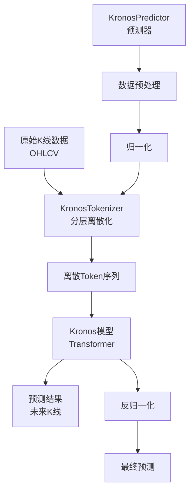

# Kronos 金融市场基础模型 - 项目概述与架构

## 🎯 项目简介

**Kronos** 是首个专为金融市场K线数据设计的开源基础模型，基于来自全球45个交易所的数据进行训练。它是一个decoder-only的Transformer架构模型，专门处理金融市场的"语言"——K线序列数据。

### 核心特点
- 🚀 **专业性**: 专为金融K线数据优化，不同于通用时间序列模型
- 🔧 **两阶段架构**: 分层离散化tokenizer + 大型自回归Transformer
- 📊 **多维数据处理**: 支持OHLCV（开高低收量）多维连续数据
- 🎯 **统一框架**: 可用于多种量化任务的统一模型
- 🌐 **多模型支持**: 提供mini/small/base等不同规模的预训练模型

## 🏗️ 项目架构

### 核心组件

### 1. **模型层 (model/)**
- [`kronos.py`](model/kronos.py): 核心模型实现
  - `KronosTokenizer`: 将连续K线数据转换为离散token
  - `Kronos`: 主要的Transformer预测模型  
  - `KronosPredictor`: 高级预测接口，处理完整预测流程
- [`module.py`](model/module.py): 模型组件和模块定义

### 2. **Web界面 (webui/)**
- [`app.py`](webui/app.py): Flask Web应用主程序
- [`templates/index.html`](webui/templates/index.html): Web界面模板
- **功能特性**:
  - 多格式数据支持（CSV、Feather）
  - 智能时间窗口选择（400+120数据点）
  - 实时模型预测
  - 预测质量控制参数
  - 多设备支持（CPU、CUDA、MPS）
  - K线图表展示

### 3. **微调训练 (finetune/)**
- [`config.py`](finetune/config.py): 训练配置参数
- [`dataset.py`](finetune/dataset.py): 数据集处理
- [`train_tokenizer.py`](finetune/train_tokenizer.py): Tokenizer微调
- [`train_predictor.py`](finetune/train_predictor.py): 预测器微调
- [`qlib_data_preprocess.py`](finetune/qlib_data_preprocess.py): Qlib数据预处理
- [`qlib_test.py`](finetune/qlib_test.py): 回测评估

### 4. **示例代码 (examples/)**
- [`prediction_example.py`](examples/prediction_example.py): 基础预测示例
- [`prediction_batch_example.py`](examples/prediction_batch_example.py): 批量预测示例
- [`prediction_wo_vol_example.py`](examples/prediction_wo_vol_example.py): 无成交量预测示例

## 📋 模型规格

| 模型 | Tokenizer | 上下文长度 | 参数量 | 开源状态 |
|------|-----------|------------|--------|----------|
| Kronos-mini | [Kronos-Tokenizer-2k](https://huggingface.co/NeoQuasar/Kronos-Tokenizer-2k) | 2048 | 4.1M | ✅ |
| Kronos-small | [Kronos-Tokenizer-base](https://huggingface.co/NeoQuasar/Kronos-Tokenizer-base) | 512 | 24.7M | ✅ |
| Kronos-base | [Kronos-Tokenizer-base](https://huggingface.co/NeoQuasar/Kronos-Tokenizer-base) | 512 | 102.3M | ✅ |
| Kronos-large | [Kronos-Tokenizer-base](https://huggingface.co/NeoQuasar/Kronos-Tokenizer-base) | 512 | 499.2M | ❌ |

## 🔄 工作流程

### 数据处理流程
1. **数据输入**: 历史K线数据（OHLCV格式）
2. **预处理**: 数据清洗、归一化、时间戳处理
3. **Tokenization**: 连续数据转换为离散token序列
4. **模型推理**: Transformer生成未来token序列
5. **后处理**: Token解码、反归一化、结果输出

### 预测参数控制
- **Temperature (T)**: 控制预测随机性 (0.1-2.0)
- **Nucleus Sampling (top_p)**: 控制预测多样性 (0.1-1.0)  
- **Sample Count**: 生成多个预测样本进行平均 (1-5)

## 🎯 应用场景

### 1. **金融预测**
- 股票价格预测
- 加密货币走势分析
- 商品期货预测
- 外汇汇率预测

### 2. **量化交易**
- 信号生成
- 风险管理
- 投资组合优化
- 回测分析

### 3. **研究分析**
- 市场行为研究
- 模式识别
- 异常检测
- 趋势分析

## 🔧 技术特色

### 1. **专业化设计**
- 针对金融数据的高噪声特性优化
- 处理多维时间序列的复杂关系
- 适应不同时间频率的数据

### 2. **灵活性**
- 支持不同长度的历史窗口
- 可调节的预测长度
- 多种采样策略

### 3. **可扩展性**
- 支持微调适应特定市场
- 可集成到现有量化系统
- 支持批量处理

## 📊 性能特点

- **上下文长度**: 最大512（small/base）或2048（mini）
- **预测长度**: 灵活可调，推荐120个时间点
- **输入窗口**: 推荐400个历史时间点
- **处理速度**: 支持GPU加速，批量预测优化
- **内存效率**: 梯度累积和优化的批处理

## 🔗 相关资源

- **论文**: [arXiv:2508.02739](https://arxiv.org/abs/2508.02739)
- **在线演示**: [Live Demo](https://shiyu-coder.github.io/Kronos-demo/)
- **模型下载**: [Hugging Face Hub](https://huggingface.co/NeoQuasar)
- **许可证**: MIT License

---

*本文档提供了Kronos项目的整体架构概览，详细的使用说明请参考后续的具体操作指南。*