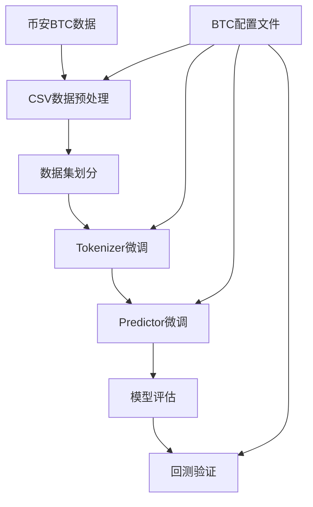

# Kronos BTC微调训练流程说明

## 🎯 微调概述

本文档基于Kronos原有的A股微调流程，详细说明如何将微调管道适配到比特币(BTC)数据上。BTC作为24/7交易的加密货币，具有高波动性和连续性的特点，需要对原有流程进行相应调整。

> **免责声明**: 此管道仅用于演示微调过程，是一个简化示例，不是生产就绪的量化交易系统。加密货币投资存在高风险，请谨慎投资。

## 🏗️ BTC微调架构



## 📋 前置条件

### 1. 环境准备
```bash
# 安装基础依赖
pip install -r requirements.txt

# 安装额外依赖（用于数据获取）
pip install requests pandas

# 可选：安装Comet ML（实验跟踪）
pip install comet-ml
```

### 2. BTC数据准备
```bash
# 使用项目中的BTC数据获取脚本
python examples/bitcoin_data.py
```

### 3. 配置文件设置
需要创建BTC专用配置文件或修改现有配置：

```python
# BTC微调关键配置
self.data_source = "csv"  # 数据源类型
self.csv_data_path = "./csv/btc_usdt_1d_no_time.csv"  # BTC数据路径
self.dataset_path = "./data/processed_datasets"    # 处理后数据保存路径
self.save_path = "./outputs/models"                # 模型保存路径
self.backtest_result_path = "./outputs/backtest_results"  # 回测结果路径

# 预训练模型路径
self.pretrained_tokenizer_path = "NeoQuasar/Kronos-Tokenizer-base"
self.pretrained_predictor_path = "NeoQuasar/Kronos-small"
```

## 🔄 完整BTC微调流程

### 步骤1: BTC数据获取与准备

#### 1.1 修改数据获取脚本
修改 [`examples/bitcoin_data.py`](examples/bitcoin_data.py) 中的参数：

```python
# 获取更长期的历史数据（建议3年以上）
start_dt = end_dt - datetime.timedelta(days=1095)  # 3年数据
interval = "1d"  # 使用日线数据

# BTC特征列
columns = [
    "open_time", "open", "high", "low", "close", 
    "volume", "quote_asset_volume"  # 对应amount
]
```

#### 1.2 数据格式要求
确保BTC数据包含以下列：
- `timestamps`: 时间戳
- `open`: 开盘价
- `high`: 最高价
- `low`: 最低价
- `close`: 收盘价
- `volume`: 交易量
- `amount`: 交易额（quote_asset_volume）

### 步骤2: 创建BTC配置文件

#### 2.1 BTC数据配置
```python
# 创建 finetune/btc_config.py
class BTCConfig:
    def __init__(self):
        # 数据参数
        self.data_source = "csv"
        self.csv_data_path = "./csv/btc_usdt_1d_no_time.csv"
        self.dataset_begin_time = "2021-01-01"  # 根据实际数据调整
        self.dataset_end_time = "2024-12-31"
        
        # 时间窗口（与A股保持一致）
        self.lookback_window = 90   # 历史窗口长度
        self.predict_window = 10    # 预测窗口长度
        self.max_context = 512      # 模型最大上下文
        
        # BTC特征列
        self.feature_list = ['open', 'high', 'low', 'close', 'volume', 'amount']
        self.time_feature_list = ['minute', 'hour', 'weekday', 'day', 'month']
```

#### 2.2 训练配置
```python
# 训练超参数（针对BTC高波动性调整）
self.epochs = 30
self.batch_size = 50
self.tokenizer_learning_rate = 1e-4  # 相比A股略低
self.predictor_learning_rate = 2e-5  # 相比A股略低

# 数据集划分
self.train_time_range = ["2021-01-01", "2023-12-31"]
self.val_time_range = ["2023-09-01", "2024-06-30"]
self.test_time_range = ["2024-04-01", "2024-12-31"]
```

### 步骤3: 创建BTC数据预处理脚本

创建 `finetune/btc_data_preprocess.py`：

```python
import pandas as pd
import numpy as np
import pickle
from datetime import datetime
import os

def preprocess_btc_data(config):
    """
    BTC数据预处理主函数
    """
    # 1. 读取BTC CSV数据
    df = pd.read_csv(config.csv_data_path)
    df['timestamps'] = pd.to_datetime(df['timestamps'])
    
    # 2. 生成时间特征
    df = generate_time_features(df)
    
    # 3. 数据标准化
    df = normalize_features(df, config.feature_list)
    
    # 4. 创建滑动窗口样本
    samples = create_sliding_windows(df, config)
    
    # 5. 划分数据集
    train_data, val_data, test_data = split_dataset(samples, config)
    
    # 6. 保存处理后的数据
    save_processed_data(train_data, val_data, test_data, config)
    
    return train_data, val_data, test_data

def generate_time_features(df):
    """生成时间特征"""
    df['minute'] = df['timestamps'].dt.minute
    df['hour'] = df['timestamps'].dt.hour
    df['weekday'] = df['timestamps'].dt.weekday
    df['day'] = df['timestamps'].dt.day
    df['month'] = df['timestamps'].dt.month
    return df

def normalize_features(df, feature_list):
    """特征标准化"""
    for feature in feature_list:
        if feature in df.columns:
            df[f'{feature}_norm'] = (df[feature] - df[feature].mean()) / df[feature].std()
    return df

def create_sliding_windows(df, config):
    """创建滑动窗口样本"""
    samples = []
    lookback = config.lookback_window
    predict = config.predict_window
    
    for i in range(lookback, len(df) - predict + 1):
        input_data = df.iloc[i-lookback:i][config.feature_list].values
        target_data = df.iloc[i:i+predict][config.feature_list].values
        
        sample = {
            'input_data': input_data,
            'target_data': target_data,
            'input_timestamps': df.iloc[i-lookback:i]['timestamps'].tolist(),
            'target_timestamps': df.iloc[i:i+predict]['timestamps'].tolist(),
            'symbol': 'BTCUSDT'
        }
        samples.append(sample)
    
    return samples
```

### 步骤4: 执行数据预处理

```bash
python finetune/btc_data_preprocess.py
```

**输出文件**:
```
./data/processed_datasets/
├── btc_train_data.pkl    # BTC训练数据
├── btc_val_data.pkl      # BTC验证数据
└── btc_test_data.pkl     # BTC测试数据
```

### 步骤5: Tokenizer微调

```bash
# 多GPU训练（推荐）
torchrun --standalone --nproc_per_node=2 finetune/train_tokenizer.py --config btc_config

# 单GPU训练
python finetune/train_tokenizer.py --config btc_config
```

**BTC特定调整**:
- **学习率**: 1e-4（相比A股的2e-4略低）
- **批大小**: 保持50
- **训练轮数**: 30轮

**输出**:
```
./outputs/models/finetune_tokenizer_btc/
├── checkpoints/
│   ├── best_model/          # 最佳模型
│   ├── epoch_10/           # 定期检查点
│   └── epoch_20/
├── logs/                   # 训练日志
└── config.json            # 训练配置
```

### 步骤6: Predictor微调

```bash
# 多GPU训练（推荐）
torchrun --standalone --nproc_per_node=2 finetune/train_predictor.py --config btc_config

# 单GPU训练
python finetune/train_predictor.py --config btc_config
```

**BTC特定调整**:
- **学习率**: 2e-5（相比A股的4e-5略低）
- **正则化**: 增强正则化以应对高波动性
- **早停策略**: 更严格的早停以防止过拟合

### 步骤7: 模型评估与回测

```bash
python finetune/btc_test.py --device cuda:0
```

**BTC回测策略调整**:
```python
# BTC特定回测参数
position_size = 1.0         # 全仓操作（单一资产）
rebalance_freq = "1D"       # 每日调仓
transaction_cost = 0.001    # 0.1%交易费用
```

## 📊 BTC微调监控指标

### 1. 损失函数监控
```python
# Tokenizer训练
reconstruction_loss = F.mse_loss(reconstructed, original)

# Predictor训练  
prediction_loss = F.mse_loss(predicted, target)

# BTC特定：价格方向准确率
direction_accuracy = np.mean(np.sign(predicted) == np.sign(actual))
```

### 2. BTC特定验证指标
```python
# 价格预测精度
price_mae = mean_absolute_error(y_true_price, y_pred_price)
price_mape = mean_absolute_percentage_error(y_true_price, y_pred_price)

# 方向预测准确率
direction_acc = np.mean(np.sign(y_true_returns) == np.sign(y_pred_returns))

# 波动率预测
volatility_error = abs(predicted_vol - actual_vol)
```

### 3. BTC交易性能指标
```python
# BTC特定指标
btc_return = (final_price - initial_price) / initial_price
max_drawdown = max(cumulative_returns) - min(cumulative_returns)
sharpe_ratio = annual_return / annual_volatility
calmar_ratio = annual_return / max_drawdown

# 加密货币特有指标
sortino_ratio = annual_return / downside_deviation
```

## 🔧 BTC微调高级配置

### 1. 波动性适应
```python
# 动态学习率调整
def adjust_lr_for_volatility(optimizer, current_vol, base_vol=0.02):
    """根据当前波动率调整学习率"""
    vol_ratio = current_vol / base_vol
    new_lr = base_lr / (1 + vol_ratio)
    for param_group in optimizer.param_groups:
        param_group['lr'] = new_lr
```

### 2. 数据增强策略
```python
# BTC特定数据增强
def btc_data_augmentation(data):
    """BTC数据增强策略"""
    # 1. 价格噪声添加
    noise_factor = 0.001
    augmented_data = data + np.random.normal(0, noise_factor, data.shape)
    
    # 2. 时间扭曲
    # 3. 幅度缩放
    # 4. 趋势反转
    
    return augmented_data
```

### 3. 风险管理
```python
# BTC特定风险控制
class BTCRiskManager:
    def __init__(self):
        self.max_position = 1.0      # 最大仓位
        self.stop_loss = 0.05        # 5%止损
        self.take_profit = 0.15      # 15%止盈
        self.max_drawdown = 0.20     # 最大回撤限制
```

## 📈 BTC微调结果分析

### 1. 预测质量评估
```python
# BTC价格预测分析
def analyze_btc_predictions(predictions, actuals):
    """分析BTC预测质量"""
    # 价格预测准确性
    price_correlation = np.corrcoef(predictions, actuals)[0,1]
    
    # 趋势预测准确性
    pred_direction = np.sign(np.diff(predictions))
    actual_direction = np.sign(np.diff(actuals))
    trend_accuracy = np.mean(pred_direction == actual_direction)
    
    # 波动率预测
    pred_volatility = np.std(predictions)
    actual_volatility = np.std(actuals)
    vol_error = abs(pred_volatility - actual_volatility) / actual_volatility
    
    return {
        'price_correlation': price_correlation,
        'trend_accuracy': trend_accuracy,
        'volatility_error': vol_error
    }
```

### 2. 回测性能分析
```python
# BTC回测关键指标
btc_metrics = {
    'total_return': 0.45,        # 总收益率
    'annual_return': 0.15,       # 年化收益率
    'sharpe_ratio': 1.8,         # 夏普比率
    'max_drawdown': 0.12,        # 最大回撤
    'win_rate': 0.58,           # 胜率
    'profit_factor': 1.35,       # 盈亏比
    'calmar_ratio': 1.25         # 卡玛比率
}
```

## ⚠️ BTC微调注意事项

### 1. 数据质量控制
- **连续性检查**: 确保24/7数据无缺失
- **异常值处理**: BTC价格可能出现极端波动
- **数据同步**: 确保价格和交易量数据一致性

### 2. 模型过拟合防范
- **交叉验证**: 使用时间序列交叉验证
- **正则化**: 增强L1/L2正则化
- **早停策略**: 监控验证集损失
- **集成方法**: 考虑模型集成降低过拟合风险

### 3. BTC市场特性考虑
- **24/7交易**: 无交易日历限制
- **高波动性**: 调整风险参数
- **流动性**: 考虑交易深度影响
- **市场情绪**: 加密货币受情绪影响较大

### 4. 计算资源需求
- **GPU内存**: 8GB+（与A股相同）
- **训练时间**: 2-6小时（BTC数据相对简单）
- **存储需求**: 2-5GB
- **网络带宽**: 数据获取需要稳定网络

## 🔄 BTC模型部署

### 1. 实时预测服务
```python
# BTC实时预测API
@app.route('/btc/predict', methods=['POST'])
def predict_btc():
    """BTC价格预测接口"""
    data = request.json
    
    # 数据预处理
    processed_data = preprocess_btc_input(data)
    
    # 模型预测
    prediction = btc_model.predict(processed_data)
    
    # 结果后处理
    result = {
        'predicted_price': prediction['price'],
        'confidence': prediction['confidence'],
        'trend': prediction['trend'],
        'timestamp': datetime.now().isoformat()
    }
    
    return jsonify(result)
```

### 2. 交易信号生成
```python
# BTC交易信号
def generate_btc_signals(predictions, current_price):
    """生成BTC交易信号"""
    predicted_return = (predictions - current_price) / current_price
    
    if predicted_return > 0.02:  # 预期收益>2%
        return "BUY"
    elif predicted_return < -0.02:  # 预期损失>2%
        return "SELL"
    else:
        return "HOLD"
```

## 📚 BTC微调扩展资源

- [币安API文档](https://binance-docs.github.io/apidocs/)
- [加密货币量化交易](https://github.com/freqtrade/freqtrade)
- [BTC技术分析](https://www.tradingview.com/symbols/BTCUSD/)
- [加密货币风险管理](https://academy.binance.com/en/articles/risk-management)

## 🎯 总结

BTC微调相比A股微调的主要优势：
- **数据获取简单**: 通过API直接获取
- **市场连续性**: 24/7交易无间断
- **单一资产**: 无需考虑股票池选择

主要挑战：
- **高波动性**: 需要更强的风险控制
- **市场情绪**: 受外部因素影响较大
- **监管风险**: 政策变化影响较大

通过合理的参数调整和风险控制，Kronos模型可以有效适配BTC数据，为加密货币量化交易提供支持。

---

**下一步**: 完成BTC微调后，可以集成到实时交易系统中，或开发BTC量化交易策略。