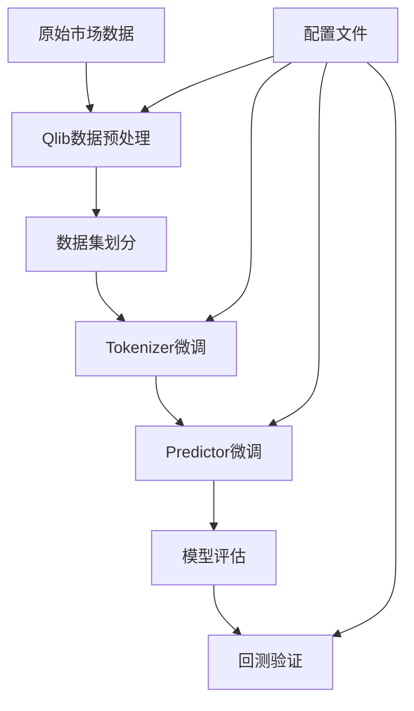

# Kronos 微调训练流程说明

## 🎯 微调概述

Kronos提供了完整的微调管道，允许用户在自己的数据集上进行模型微调，以适应特定市场或交易策略。本指南以中国A股市场为例，展示完整的微调流程。

> **免责声明**: 此管道仅用于演示微调过程，是一个简化示例，不是生产就绪的量化交易系统。

## 🏗️ 微调架构



## 📋 前置条件

### 1. 环境准备
```bash
# 安装基础依赖
pip install -r requirements.txt

# 安装Qlib（用于A股数据）
pip install pyqlib

# 可选：安装Comet ML（实验跟踪）
pip install comet-ml
```

### 2. 数据准备
```bash
# 下载并设置Qlib数据
# 参考官方指南: https://github.com/microsoft/qlib
```

### 3. 配置文件设置
编辑 [`finetune/config.py`](finetune/config.py) 中的关键路径：

```python
# 必须修改的路径
self.qlib_data_path = "~/.qlib/qlib_data/cn_data"  # Qlib数据路径
self.dataset_path = "./data/processed_datasets"    # 处理后数据保存路径
self.save_path = "./outputs/models"                # 模型保存路径
self.backtest_result_path = "./outputs/backtest_results"  # 回测结果路径

# 预训练模型路径
self.pretrained_tokenizer_path = "NeoQuasar/Kronos-Tokenizer-base"
self.pretrained_predictor_path = "NeoQuasar/Kronos-small"
```

## 🔄 完整微调流程

### 步骤1: 配置实验参数

#### 1.1 数据配置
```python
# 在 config.py 中设置
class Config:
    # 数据参数
    self.instrument = 'csi300'  # 股票池：csi300/csi800/csi1000
    self.dataset_begin_time = "2011-01-01"
    self.dataset_end_time = '2025-06-05'
    
    # 时间窗口
    self.lookback_window = 90   # 历史窗口长度
    self.predict_window = 10    # 预测窗口长度
    self.max_context = 512      # 模型最大上下文
    
    # 特征列
    self.feature_list = ['open', 'high', 'low', 'close', 'vol', 'amt']
    self.time_feature_list = ['minute', 'hour', 'weekday', 'day', 'month']
```

#### 1.2 训练配置
```python
# 训练超参数
self.epochs = 30
self.batch_size = 50
self.tokenizer_learning_rate = 2e-4
self.predictor_learning_rate = 4e-5

# 数据集划分
self.train_time_range = ["2011-01-01", "2022-12-31"]
self.val_time_range = ["2022-09-01", "2024-06-30"]
self.test_time_range = ["2024-04-01", "2025-06-05"]
```

#### 1.3 实验跟踪配置
```python
# Comet ML配置（可选）
self.use_comet = True
self.comet_config = {
    "api_key": "YOUR_COMET_API_KEY",
    "project_name": "Kronos-Finetune-Demo",
    "workspace": "your_comet_workspace"
}
```

### 步骤2: 数据预处理

```bash
python finetune/qlib_data_preprocess.py
```

**功能说明**:
- 从Qlib加载原始市场数据
- 生成时间特征
- 创建滑动窗口样本
- 划分训练/验证/测试集
- 保存为pickle文件

**输出文件**:
```
./data/processed_datasets/
├── train_data.pkl    # 训练数据
├── val_data.pkl      # 验证数据
└── test_data.pkl     # 测试数据
```

**数据格式**:
```python
# 每个样本的结构
{
    'input_data': tensor,      # 输入特征 [lookback_window, feature_dim]
    'target_data': tensor,     # 目标数据 [predict_window, feature_dim]
    'input_timestamps': list,  # 输入时间戳
    'target_timestamps': list, # 目标时间戳
    'symbol': str             # 股票代码
}
```

### 步骤3: Tokenizer微调

```bash
# 多GPU训练（推荐）
torchrun --standalone --nproc_per_node=2 finetune/train_tokenizer.py

# 单GPU训练
python finetune/train_tokenizer.py
```

**训练过程**:
1. 加载预训练Tokenizer
2. 在新数据上微调编码器
3. 优化重构损失
4. 保存最佳检查点

**关键参数**:
```python
# 在训练脚本中
learning_rate = config.tokenizer_learning_rate  # 2e-4
batch_size = config.batch_size                  # 50
epochs = config.epochs                          # 30
```

**输出**:
```
./outputs/models/finetune_tokenizer_demo/
├── checkpoints/
│   ├── best_model/          # 最佳模型
│   ├── epoch_10/           # 定期检查点
│   └── epoch_20/
├── logs/                   # 训练日志
└── config.json            # 训练配置
```

### 步骤4: Predictor微调

```bash
# 多GPU训练（推荐）
torchrun --standalone --nproc_per_node=2 finetune/train_predictor.py

# 单GPU训练
python finetune/train_predictor.py
```

**训练过程**:
1. 加载微调后的Tokenizer
2. 加载预训练Predictor
3. 在新数据上微调预测器
4. 优化预测损失
5. 保存最佳检查点

**关键参数**:
```python
learning_rate = config.predictor_learning_rate  # 4e-5
batch_size = config.batch_size                  # 50
accumulation_steps = config.accumulation_steps  # 1
```

**输出**:
```
./outputs/models/finetune_predictor_demo/
├── checkpoints/
│   ├── best_model/          # 最佳模型
│   ├── epoch_15/           # 定期检查点
│   └── epoch_25/
├── logs/                   # 训练日志
└── config.json            # 训练配置
```

### 步骤5: 模型评估与回测

```bash
python finetune/qlib_test.py --device cuda:0
```

**评估过程**:
1. 加载微调后的模型
2. 在测试集上生成预测
3. 计算预测信号
4. 执行回测策略
5. 生成性能报告

**回测策略**:
```python
# Top-K策略配置
n_symbol_hold = 50      # 持仓股票数量
n_symbol_drop = 5       # 剔除股票数量
hold_thresh = 5         # 最小持仓期
```

**输出结果**:
```
./outputs/backtest_results/
├── backtest_results.json    # 详细结果
├── performance_plot.png     # 收益曲线图
└── analysis_report.txt      # 分析报告
```

## 📊 训练监控

### 1. 损失函数监控
```python
# Tokenizer训练
reconstruction_loss = F.mse_loss(reconstructed, original)

# Predictor训练  
prediction_loss = F.mse_loss(predicted, target)
```

### 2. 验证指标
```python
# 预测精度指标
mae = mean_absolute_error(y_true, y_pred)
mse = mean_squared_error(y_true, y_pred)
r2 = r2_score(y_true, y_pred)

# 金融指标
sharpe_ratio = annual_return / annual_volatility
max_drawdown = max(cumulative_returns) - min(cumulative_returns)
```

### 3. Comet ML集成
```python
# 自动记录的指标
experiment.log_metric("train_loss", loss)
experiment.log_metric("val_loss", val_loss)
experiment.log_metric("learning_rate", lr)
experiment.log_parameters(config.__dict__)
```

## 🔧 高级配置

### 1. 多GPU训练配置
```bash
# 设置GPU数量
export CUDA_VISIBLE_DEVICES=0,1,2,3

# 启动分布式训练
torchrun --standalone --nproc_per_node=4 finetune/train_predictor.py
```

### 2. 内存优化
```python
# 梯度累积
accumulation_steps = 4  # 有效批大小 = batch_size * accumulation_steps

# 混合精度训练
use_amp = True
scaler = GradScaler()
```

### 3. 学习率调度
```python
# 余弦退火
scheduler = CosineAnnealingLR(optimizer, T_max=epochs)

# 预热策略
warmup_steps = epochs // 10
```

### 4. 数据增强
```python
# 时间序列增强
- 添加噪声
- 时间扭曲
- 幅度缩放
- 窗口切片
```

## 📈 结果分析

### 1. 训练曲线分析
```python
# 绘制损失曲线
plt.plot(train_losses, label='Training Loss')
plt.plot(val_losses, label='Validation Loss')
plt.xlabel('Epoch')
plt.ylabel('Loss')
plt.legend()
plt.show()
```

### 2. 预测质量评估
```python
# 预测vs实际对比
correlation = np.corrcoef(predictions, actuals)[0,1]
directional_accuracy = np.mean(np.sign(predictions) == np.sign(actuals))
```

### 3. 回测性能分析
```python
# 关键指标
annual_return = 0.15      # 年化收益率
sharpe_ratio = 1.2        # 夏普比率
max_drawdown = 0.08       # 最大回撤
win_rate = 0.55          # 胜率
```

## ⚠️ 注意事项

### 1. 数据质量
- 确保数据无缺失值
- 处理异常值和停牌
- 考虑股票分红除权

### 2. 过拟合防范
- 使用验证集早停
- 正则化技术
- 交叉验证

### 3. 计算资源
- GPU内存需求：8GB+
- 训练时间：数小时到数天
- 存储需求：数GB

### 4. 实际应用考虑
- 交易成本建模
- 市场冲击成本
- 流动性约束
- 风险管理

## 🔄 生产部署

### 1. 模型导出
```python
# 保存完整模型
torch.save({
    'tokenizer': tokenizer.state_dict(),
    'predictor': predictor.state_dict(),
    'config': config
}, 'kronos_finetuned.pth')
```

### 2. 推理优化
```python
# 模型量化
model = torch.quantization.quantize_dynamic(model, {torch.nn.Linear}, dtype=torch.qint8)

# TorchScript编译
scripted_model = torch.jit.script(model)
```

### 3. 服务化部署
```python
# Flask API示例
@app.route('/predict', methods=['POST'])
def predict():
    data = request.json
    prediction = model.predict(data)
    return jsonify(prediction)
```

## 📚 扩展阅读

- [Qlib官方文档](https://github.com/microsoft/qlib)
- [PyTorch分布式训练](https://pytorch.org/tutorials/intermediate/ddp_tutorial.html)
- [Comet ML实验跟踪](https://www.comet.com/docs/)
- [量化投资策略](https://www.quantstart.com/)

---

**下一步**: 完成微调后，可以使用微调后的模型进行实际预测，或集成到量化交易系统中。