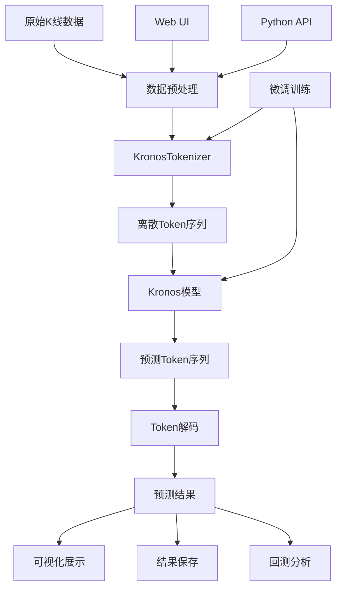
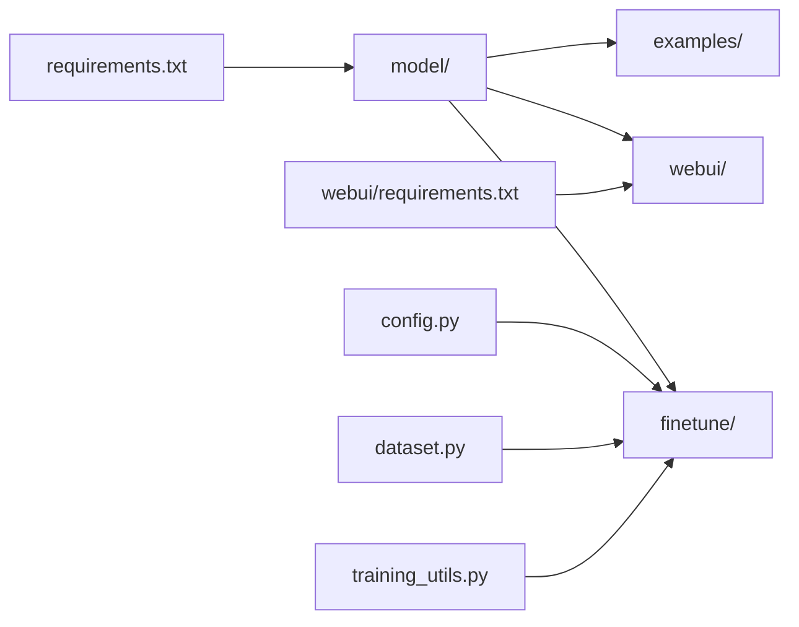

# Kronos 项目结构详细说明

## 📁 项目总览

```
Kronos/
├── 📄 README.md                    # 项目主要说明文档
├── 📄 LICENSE                      # MIT开源许可证
├── 📄 requirements.txt             # 核心依赖包列表
├── 📄 .gitignore                   # Git忽略文件配置
├── 📁 model/                       # 🔥 核心模型代码
├── 📁 examples/                    # 📚 使用示例代码
├── 📁 webui/                       # 🌐 Web用户界面
├── 📁 finetune/                    # 🔧 微调训练代码
└── 📁 figures/                     # 🖼️ 项目图片资源
```

## 🔥 核心模型模块 (model/)

### 文件结构
```
model/
├── __init__.py                     # 模块初始化，导出主要类
├── kronos.py                       # 🎯 核心模型实现
└── module.py                       # 🧩 模型组件和模块
```

### 详细说明

#### [`__init__.py`](model/__init__.py)
```python
# 主要功能：模块导出和模型注册
from .kronos import KronosTokenizer, Kronos, KronosPredictor

model_dict = {
    'kronos_tokenizer': KronosTokenizer,
    'kronos': Kronos,
    'kronos_predictor': KronosPredictor
}
```

**作用**：
- 统一模型接口导出
- 提供模型类注册机制
- 简化外部导入流程

#### [`kronos.py`](model/kronos.py) - 核心实现
**主要类**：

1. **KronosTokenizer**
   - 功能：将连续K线数据转换为离散token
   - 特点：分层离散化，处理OHLCV多维数据
   - 方法：
     - `encode()`: 数据编码
     - `decode()`: 数据解码
     - `from_pretrained()`: 加载预训练tokenizer

2. **Kronos**
   - 功能：主要的Transformer预测模型
   - 架构：Decoder-only Transformer
   - 特点：专为金融时间序列优化
   - 方法：
     - `forward()`: 前向传播
     - `generate()`: 生成预测序列
     - `from_pretrained()`: 加载预训练模型

3. **KronosPredictor**
   - 功能：高级预测接口，封装完整预测流程
   - 特点：处理数据预处理、归一化、预测、反归一化
   - 方法：
     - `predict()`: 单序列预测
     - `predict_batch()`: 批量预测
     - `preprocess()`: 数据预处理
     - `postprocess()`: 结果后处理

#### [`module.py`](model/module.py)
**功能**：
- 定义Transformer组件
- 实现注意力机制
- 提供位置编码
- 定义激活函数和层归一化

## 📚 示例代码模块 (examples/)

### 文件结构
```
examples/
├── prediction_example.py           # 🎯 基础预测示例
├── prediction_batch_example.py     # 📊 批量预测示例
├── prediction_wo_vol_example.py    # 📈 无成交量预测示例
└── data/                          # 📁 示例数据目录
```

### 详细说明

#### [`prediction_example.py`](examples/prediction_example.py)
**功能**：演示基础预测流程
**流程**：
1. 加载模型和tokenizer
2. 创建预测器
3. 准备数据（400历史+120预测）
4. 执行预测
5. 可视化结果

**关键代码**：
```python
# 模型加载
tokenizer = KronosTokenizer.from_pretrained("NeoQuasar/Kronos-Tokenizer-base")
model = Kronos.from_pretrained("NeoQuasar/Kronos-small")

# 预测执行
pred_df = predictor.predict(
    df=x_df, x_timestamp=x_timestamp, y_timestamp=y_timestamp,
    pred_len=pred_len, T=1.0, top_p=0.9, sample_count=1
)
```

#### [`prediction_batch_example.py`](examples/prediction_batch_example.py)
**功能**：演示批量预测功能
**特点**：
- 处理多个时间序列
- GPU并行加速
- 批量数据管理

#### [`prediction_wo_vol_example.py`](examples/prediction_wo_vol_example.py)
**功能**：演示无成交量数据的预测
**适用场景**：
- 只有OHLC数据
- 历史数据不完整
- 简化预测需求

## 🌐 Web用户界面 (webui/)

### 文件结构
```
webui/
├── app.py                          # 🚀 Flask主应用
├── run.py                          # 🎯 启动脚本
├── start.sh                        # 🐧 Shell启动脚本
├── README.md                       # 📖 Web UI说明文档
├── requirements.txt                # 📦 Web UI依赖
├── templates/                      # 🎨 HTML模板
│   └── index.html                  # 主页面模板
└── prediction_results/             # 💾 预测结果存储
    └── prediction_*.json           # 预测结果文件
```

### 详细说明

#### [`app.py`](webui/app.py) - 主应用
**功能模块**：

1. **数据管理**
   - `load_data_files()`: 扫描数据目录
   - `load_data_file()`: 加载数据文件
   - `validate_data()`: 数据格式验证

2. **模型管理**
   - `load_model()`: 加载Kronos模型
   - `get_available_models()`: 获取可用模型列表
   - `get_model_status()`: 检查模型状态

3. **预测功能**
   - `predict()`: 执行预测
   - `create_prediction_chart()`: 生成图表
   - `save_prediction_results()`: 保存结果

4. **API端点**
   ```python
   @app.route('/api/data-files')           # 获取数据文件列表
   @app.route('/api/load-data')            # 加载数据
   @app.route('/api/load-model')           # 加载模型
   @app.route('/api/predict')              # 执行预测
   @app.route('/api/model-status')         # 模型状态
   ```

#### [`templates/index.html`](webui/templates/index.html)
**界面组件**：
- 数据文件选择器
- 模型配置面板
- 参数调整控件
- 时间窗口选择器
- 预测结果展示区
- 交互式图表显示

#### [`run.py`](webui/run.py) 和 [`start.sh`](webui/start.sh)
**功能**：提供多种启动方式
- Python脚本启动
- Shell脚本启动
- 依赖检查和安装

## 🔧 微调训练模块 (finetune/)

### 文件结构
```
finetune/
├── config.py                       # ⚙️ 配置参数文件
├── dataset.py                      # 📊 数据集处理
├── qlib_data_preprocess.py         # 🔄 Qlib数据预处理
├── train_tokenizer.py              # 🎯 Tokenizer微调训练
├── train_predictor.py              # 🚀 Predictor微调训练
├── qlib_test.py                    # 📈 回测评估
└── utils/                          # 🛠️ 工具函数
    ├── __init__.py
    └── training_utils.py            # 训练辅助函数
```

### 详细说明

#### [`config.py`](finetune/config.py) - 配置中心
**配置类别**：

1. **数据配置**
   ```python
   self.qlib_data_path = "~/.qlib/qlib_data/cn_data"
   self.instrument = 'csi300'
   self.lookback_window = 90
   self.predict_window = 10
   ```

2. **训练配置**
   ```python
   self.epochs = 30
   self.batch_size = 50
   self.tokenizer_learning_rate = 2e-4
   self.predictor_learning_rate = 4e-5
   ```

3. **路径配置**
   ```python
   self.dataset_path = "./data/processed_datasets"
   self.save_path = "./outputs/models"
   self.backtest_result_path = "./outputs/backtest_results"
   ```

#### [`dataset.py`](finetune/dataset.py)
**功能**：
- 定义PyTorch数据集类
- 实现数据加载和预处理
- 支持滑动窗口采样
- 处理时间序列特征

#### [`qlib_data_preprocess.py`](finetune/qlib_data_preprocess.py)
**功能**：
- 从Qlib加载A股数据
- 生成时间特征
- 创建训练样本
- 数据集划分和保存

#### [`train_tokenizer.py`](finetune/train_tokenizer.py)
**功能**：
- Tokenizer微调训练
- 分布式训练支持
- 检查点保存和恢复
- 训练监控和日志

#### [`train_predictor.py`](finetune/train_predictor.py)
**功能**：
- Predictor微调训练
- 梯度累积和混合精度
- 学习率调度
- 验证和早停

#### [`qlib_test.py`](finetune/qlib_test.py)
**功能**：
- 模型评估和回测
- 策略信号生成
- 性能指标计算
- 结果可视化

## 🖼️ 资源文件 (figures/)

### 文件结构
```
figures/
├── logo.png                        # 🎨 项目Logo
├── overview.png                    # 📊 架构概览图
├── prediction_example.png          # 📈 预测示例图
└── backtest_result_example.png     # 📊 回测结果示例
```

## 📄 配置文件

### [`requirements.txt`](requirements.txt) - 核心依赖
```
numpy                    # 数值计算基础
pandas==2.2.2           # 数据处理
torch                   # 深度学习框架
einops==0.8.1          # 张量操作
huggingface_hub==0.33.1 # 模型下载
matplotlib==3.9.3      # 图表绘制
tqdm==4.67.1           # 进度条
safetensors==0.6.2     # 安全张量存储
```

### [`webui/requirements.txt`](webui/requirements.txt) - Web UI依赖
```
flask==2.3.3           # Web框架
flask-cors==4.0.0      # 跨域支持
plotly==5.17.0         # 交互式图表
```

### [`.gitignore`](.gitignore) - Git忽略配置
```
__pycache__/           # Python缓存
*.pyc                  # 编译文件
.env                   # 环境变量
models/                # 本地模型文件
data/                  # 数据文件
outputs/               # 输出结果
```

## 🔄 数据流向图



## 📊 模块依赖关系



## 🎯 关键设计模式

### 1. 工厂模式
```python
# model/__init__.py
def get_model_class(model_name):
    if model_name in model_dict:
        return model_dict[model_name]
    else:
        raise NotImplementedError
```

### 2. 策略模式
```python
# 不同的预测策略
class KronosPredictor:
    def predict(self, strategy='default'):
        if strategy == 'conservative':
            return self._conservative_predict()
        elif strategy == 'aggressive':
            return self._aggressive_predict()
```

### 3. 观察者模式
```python
# 训练过程监控
class TrainingMonitor:
    def on_epoch_end(self, epoch, logs):
        self.log_metrics(epoch, logs)
        self.save_checkpoint(epoch)
```

## 🔧 扩展指南

### 添加新模型
1. 在 `model/` 目录下创建新模型文件
2. 在 `__init__.py` 中注册模型
3. 更新 `model_dict` 字典

### 添加新功能
1. 在相应模块中实现功能
2. 添加对应的测试用例
3. 更新文档和示例

### 自定义数据处理
1. 继承 `Dataset` 类
2. 实现 `__getitem__` 和 `__len__` 方法
3. 在训练脚本中使用新数据集

---

**总结**：Kronos项目采用模块化设计，各组件职责清晰，便于维护和扩展。核心模型、Web界面、微调训练和示例代码相互独立又紧密配合，为用户提供了完整的金融预测解决方案。